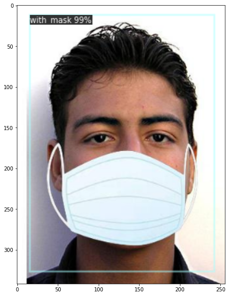

# Face-Mask-Detection with Detectron2

## 1. Installation
Install below dependencies and Detectron2

!pip install -U torch==1.5 torchvision==0.6 -f https://download.pytorch.org/whl/cu101/torch_stable.html

!pip install cython pyyaml==5.1

!pip install -U 'git+https://github.com/cocodataset/cocoapi.git#subdirectory=PythonAPI'

### Installing Detectron2
!pip install detectron2==0.1.3 -f https://dl.fbaipublicfiles.com/detectron2/wheels/cu101/torch1.5/index.html

## 2. Collecting Data

I have used images from pyimagesearch by Adrian Rosebrock

## 3. Labelling Data
We have completed collecting images, now next step is Labelling the data. Labeling is the process of drawing bounding boxes around the objects.
LabelImg is the tool which I have used, LabelImg saves the image as xml file containing the label data for each image.

For quick demo: check this [link](LabelImg.mp4)

## 4. Preparing data for training
We have to prepare the data so that it is easy to use for training.
In Detectron2 we can read a dataset directly if it's in coco format.

For more information check out the [official documentation](https://detectron2.readthedocs.io/tutorials/datasets.html#register-a-dataset)

## 5. Loading the data and trainig the model
The complete training process can be found in facemask.ipynb 

## 6. Using model for inference
With the training model, now we can use if for inference by simply loading in the weights and config and creating Default Predictor.

## Author 
  **Haneesh Beerelly**
##### Reference
  ***Gilbert Tanner***
